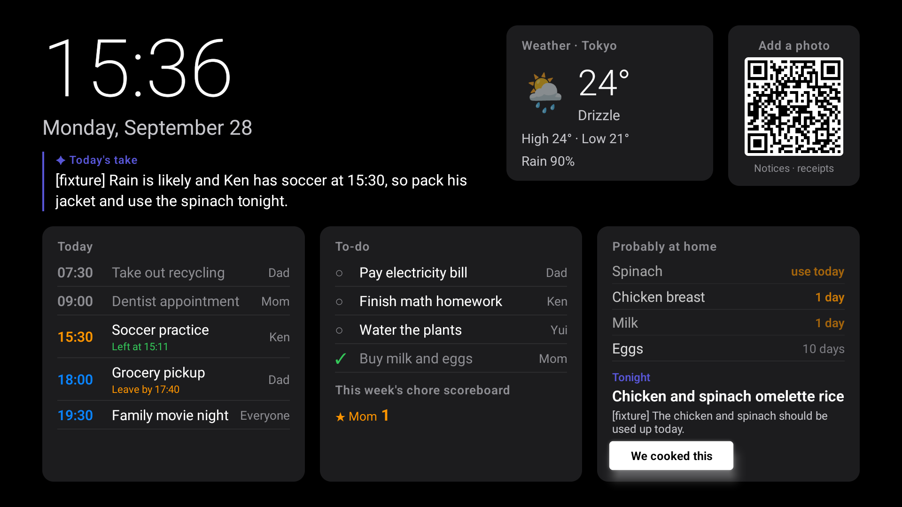
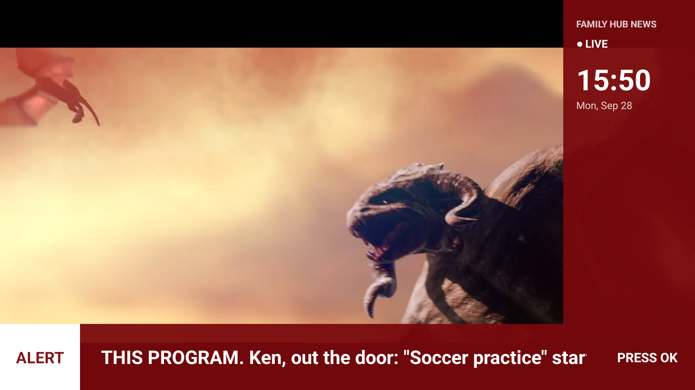

# Family Hub — the living-room TV as the family's news desk

A Fire TV app (Fire OS) that turns the TV into a shared household dashboard, and then keeps talking
even when nobody is looking at it: whatever the family is watching, important household moments
interrupt the programme as an over-the-top **breaking-news ticker**.

Built for the *Build, Ship, Shape: Amazon Developer Hackathon 2026* (Fire TV track).
AI: Amazon Nova on Amazon Bedrock. Backend: AWS Lambda + DynamoDB. App: React Native (Expo) + a small Kotlin module.




## What it does

| Feature | How it works |
|---|---|
| **Dashboard** | Clock, weather (Open-Meteo), today's schedule, to-do list, and a QR code for phones. |
| **Today's take** | Amazon Nova reads the weather, schedule, chores and kitchen together and says one line about the day. It is regenerated only when the situation changes (time of day, upcoming events, weather, chores, food). |
| **Add by photo** | Scan the QR code, photograph a school notice, flyer or grocery receipt. Nova (vision) turns notices into schedule entries and to-dos, and receipts into groceries. |
| **Probably at home** | Groceries fade out over their shelf life instead of pretending to be an exact inventory. Nova suggests tonight's dinner from what should be used up; "We cooked this" consumes the ingredients. |
| **Breaking news ticker** | A Kotlin foreground service draws an L-shaped news ticker *over any app* (needs the overlay permission, see below). Triggers: an outing within 30 minutes, food that expires today, something new added by photo, a finished chore. Headlines are written by Nova in news-channel style. |
| **Departure countdown** | For events you have to leave the house for, the server works out when to leave (travel time plus a rain margin from the forecast). 15 minutes before: a *DEVELOPING* band. 5 minutes before: *URGENT*, red, with a live countdown. At the time to leave: *WE INTERRUPT THIS PROGRAM* — playback is paused and the band waits for OK on the remote (or "I've left" on the phone); either one resumes the programme. |
| **Chore scoreboard** | Finish a chore from the phone, optionally with a photo as evidence (Nova checks it). It becomes a *GOAL!* ticker with the photo and this week's score, and the dashboard keeps the scoreboard. |

## Repository layout

```
backend/                 Node.js API (runs as an AWS Lambda Function URL, or locally with `npm run dev`)
  src/app.mjs            routes and household logic
  src/prompts.mjs        the Amazon Nova prompts
  src/model/             bedrock.mjs (Nova via the Converse API) and fixture.mjs (canned answers, no AWS)
  src/store/             dynamodb.mjs and file.mjs (both versioned; concurrent writes retry)
  src/upload-page.mjs    the phone page (photo / done / leaving)
apps/expo-multi-tv/      the TV app (Expo SDK 54, react-native-tvos)
  modules/breaking-news/ Kotlin: overlay ticker service + Expo module
packages/shared-ui/      screens and the API client (DashboardScreen.tsx is the app)
docs/                    screenshots, product feedback and friction log for the hackathon
```

The app started from Amazon's [react-native-multi-tv-app-sample](https://github.com/AmazonAppDev/react-native-multi-tv-app-sample)
(MIT-0). Its navigation, focus handling and video player are reused; the Vega, Apple TV and web
targets of the sample are not part of Family Hub.

## Requirements

- A Fire TV running Fire OS 6 or later (Android 7.1+). Tested on a Fire TV Stick 4K Max
  (Fire OS 8.1) and on the Android TV emulator (API 31). Vega OS devices are **not** supported.
- Node.js 18+, Yarn 4 (`corepack enable`), JDK 17, Android SDK platform 36 + build-tools 36.
- For the AI: an AWS account with Amazon Bedrock access to Amazon Nova Micro and Nova Lite.
  Everything can also run **without AWS** using canned answers (`MODEL_PROVIDER=fixture`).

## Quick start (no AWS needed)

1. Backend, on your computer (replace the IP with your machine's LAN address):

   ```bash
   cd backend && npm install
   MODEL_PROVIDER=fixture ACCESS_TOKEN=local-test PUBLIC_URL=http://192.168.0.10:8787 npm run dev
   ```

   `PUBLIC_URL` is what the QR code on the TV points phones to, so it must be reachable from your phone.

2. TV app:

   ```bash
   cp apps/expo-multi-tv/.env.example apps/expo-multi-tv/.env   # set EXPO_PUBLIC_API_URL / _TOKEN
   yarn install
   adb connect <fire-tv-ip>:5555        # Settings > My Fire TV > Developer options > ADB debugging
   yarn dev:android                     # builds and installs the debug app on the connected device
   ```

   The debug app loads its JavaScript from Metro at `localhost:8081` on the TV. If it stays on the
   splash screen, forward the ports over the (wireless) ADB connection and relaunch the app:

   ```bash
   adb reverse tcp:8081 tcp:8081 && adb reverse tcp:8787 tcp:8787
   ```

3. Allow the ticker to draw over other apps. Fire OS has no settings screen for this permission,
   so grant it once over ADB (the dashboard shows this command until it is done):

   ```bash
   adb shell appops set com.familyhub.tv SYSTEM_ALERT_WINDOW allow
   ```

4. On the TV: scan the QR code with a phone to open the phone page. Press **Play/Pause** on the
   remote to open a programme (the Sintel trailer, CC BY 3.0) and watch the ticker interrupt it.

### Trying the departure countdown without waiting for 15:10

```bash
TIME_SHIFT_MINUTES=<n> ... npm run dev        # run the whole household on a shifted clock
curl -H 'x-access-token: local-test' -H 'x-fake-time: 15:05' localhost:8787/alerts   # one request at another time
curl -X POST -H 'x-access-token: local-test' localhost:8787/reset                    # start over with today's sample data
```

The sample household has Ken's soccer practice at 15:30; with rain in the forecast the time to leave is 15:10.

## Running on AWS (Amazon Nova + DynamoDB)

1. **Bedrock**: enable model access for Amazon Nova Micro and Nova Lite in your region
   (cross-region inference profiles such as `us.amazon.nova-micro-v1:0` work too).
2. **DynamoDB**: create a table with partition key `pk` (string). The whole household is one item.
3. **Lambda**: Node.js 22, handler `src/lambda.mjs`, timeout 60 s, memory 512 MB, with a
   **Function URL** (auth type NONE; the app's own token protects every route). Environment variables:

   | Variable | Value |
   |---|---|
   | `ACCESS_TOKEN` | a long random string |
   | `PUBLIC_URL` | the Function URL |
   | `TABLE_NAME` | the DynamoDB table |
   | `TEXT_MODEL_ID` | e.g. `us.amazon.nova-micro-v1:0` |
   | `VISION_MODEL_ID` | e.g. `us.amazon.nova-lite-v1:0` |
   | `TIMEZONE`, `LOCATION_NAME`, `LATITUDE`, `LONGITUDE`, `FAMILY` | see `backend/.env.example` |

   Execution role: `bedrock:InvokeModel` on the two models and `dynamodb:GetItem` / `PutItem` on the table.
   Deploy the contents of `backend/` (with `node_modules`) as the function code.
4. Point the TV app at it: `EXPO_PUBLIC_API_URL=https://<id>.lambda-url.<region>.on.aws` and the same token.

The dev server can also use Nova directly: `MODEL_PROVIDER=bedrock` with AWS credentials in the environment.

## API (all routes need `x-access-token`)

| Route | Purpose |
|---|---|
| `GET /state` | schedule (with leave-by times), to-dos, scoreboard, location |
| `GET /briefing` | Today's take |
| `GET /kitchen`, `POST /kitchen/cooked {uses:[ids]}` | probably-at-home groceries and tonight's idea |
| `POST /scan {image, format}` | photo of a notice or receipt |
| `GET /todos`, `POST /todos/done {id, who, image?, force?}` | chores; a photo is checked by Nova first |
| `GET /departures`, `POST /departed {id}` | today's outings and "I've left" |
| `GET /alerts`, `POST /alerts/ack {id}` | what the ticker should show; OK on the remote |
| `GET /qr`, `GET /phone` | the QR code and the phone page |
| `POST /reset` | demo helper: reseed today's sample household |

## Design notes

- The TV never holds AWS credentials; only the Lambda talks to Bedrock and DynamoDB.
- Nova is asked once per situation and the answer is cached in the household state, so a TV
  polling every 30–60 seconds costs a handful of model calls a day.
- The state is one DynamoDB item with a version number; concurrent writes (two phones, the TV)
  retry instead of overwriting each other.
- Sticky alerts (the countdown) stay on screen while the server keeps returning them; one-shot
  alerts are remembered by id on the TV so they show once.

## Known limitations

- Playback pause at the interrupt stage uses the media pause key; whether a given third-party app
  honours it depends on that app. The built-in programme (Play/Pause on the dashboard) always pauses.
- The overlay permission must be granted over ADB on Fire OS.
- The clock on the dashboard is the TV's local time; the server decides what "today" is from `TIMEZONE`.

## Credits and license

- Based on Amazon's react-native-multi-tv-app-sample (MIT-0). Family Hub is released under the same
  license, see `LICENSE`.
- Weather data by [Open-Meteo](https://open-meteo.com/) (CC BY 4.0).
- Demo programme: *Sintel* trailer, © copyright Blender Foundation | durian.blender.org, CC BY 3.0.
